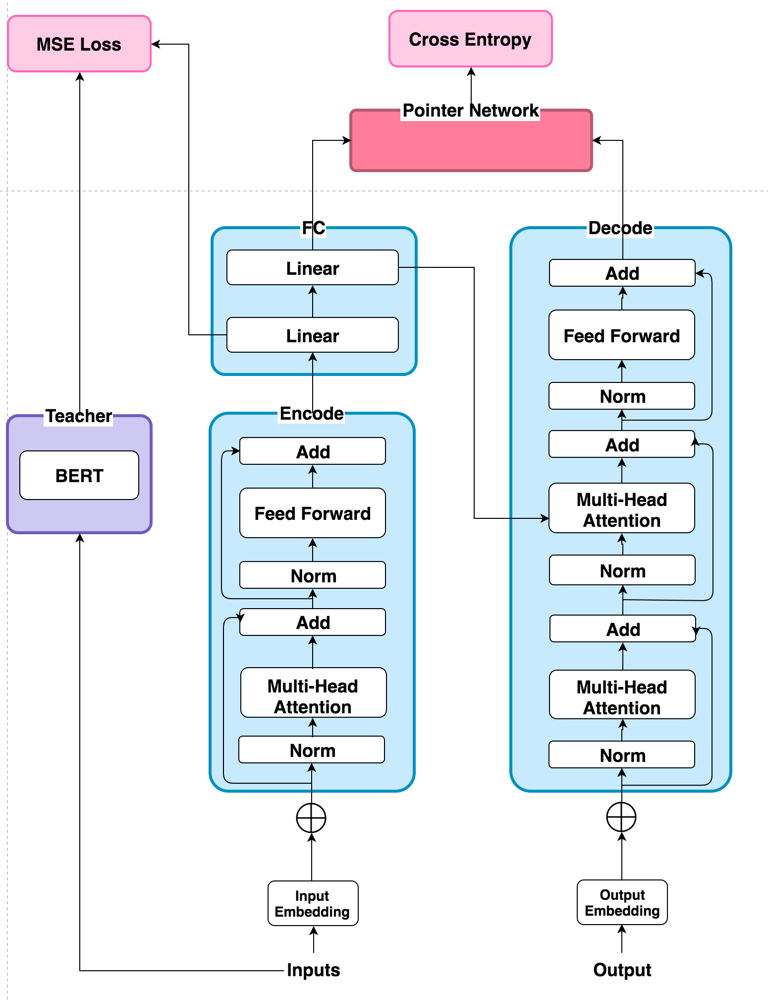

## Co-Reference

* Transformer + pointer network + distillation

### Architecture of Model

## Requirement

* TensorFlow 1.14

## Quality of Sentence ReWriting

|Precision|F1|
|--|--|
|96%|93%|

* [Rouge-l](https://github.com/ne7ermore/deeping-flow/blob/master/coreference/common.py#L153)